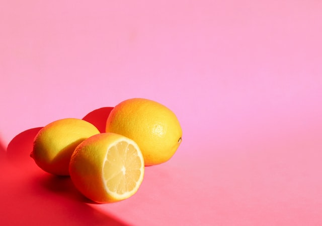

# image-lambda

### How to use lambda

+ Create lambda function
  + paste code in lambda function
+ Create S3 buckets
  + full size: lab-17
  + thumbnail size: lab-17-resized
+ add jpeg image to full size bucket
+ upload zip file
+ Add test
+ Change appropriate role to AmazonS3FullAccess
+ Image was added to resize bucket!

### Issues with deployment

+ I had problems with zipping up all of my node modules. Through the command line Dina taught me `zip -9 -y -r -q function.zip .` and then I ran into issues with my IAM role. I kept getting errors for `index.handler` then `module sharp` so I uninstalled and reinstalled sharp which then got me to the next error.

### Full size and thumbnail size images

+ 
+ 

### Contributors and collaborators

+ Tina Myers, Sara Strasner, Dina Ayoub and Brai Frauen